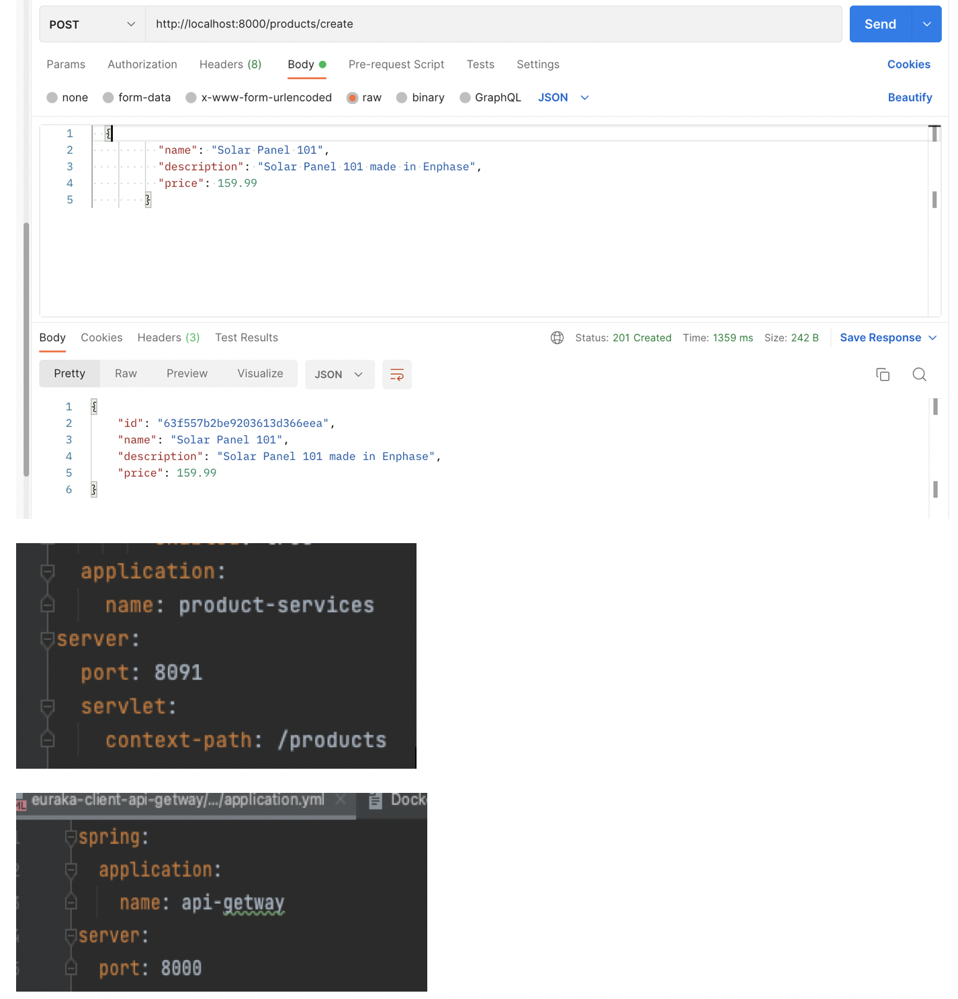

# microservice-master
SpringBoot microservice 

## Environment. 

  Intellij Community Edition and more
  
  One parent project and 6 modules
  
  SpringBoot 2.7.8 
  
  Eureka Discovery Server
  
  Eureka Client
  
  Open Feign Client Interface
  
  Resilience4J Circuit Break
  
  Spring Cloud API Getway
  
  kafka 3.4.0 or Confluent Kafka 
     
  Mongodb 4.4.18
  
  MySQL 8.0.28
  
  JDK 1.8 
  
  Rest API
  
  ModelMapper
  
  Global Exception Handler 
 
  Spring Lombok
  
  Mongodb 4.4.18
  
  mysql 8.0.28
  
  Docker
  
  
## Microservices and applied technologies

  microservice-master --- parent pom.xml hodling all 6 modules names, spring boot version, spring cloud version , dependencyManagement, build plgin 

  eureka-name-server ---- register, discovery and load balance for all microservices
  
  eureka-client-api-getway ---- supported by spring-cloud-starter-gateway to route to services, new replace of zuul
  
  OPEN FEIGN ---- feign client interfaces to have services communicate other other, rew replace of Webclient of web-flux
  
  RESILIENCE4J ---- circuit breaker and fallback support, new replace of hystrix
  
  KAFKA EVENT DRIVEN ---- kafka producer and consumer Serialize/Deserialize Json Object via using confluent zookeeper and kafka docker-compose
  
  product-service ---- Eureka Client, create products in Mongodb,  authenticate mongo, configure MongoRepository, provide 5 rest APIs
  
  inventory-service ---- Eureka/Feign Client, create inventory in MySQL, productId, product name, price call product service by product 
  
  order-service ---- Eureka/Feign Client, Resilience4J, Kafka Producer, place order to MySQL, check inventory quantity, send event to notification
  
  notification-service ---- Kafka Consumer, listening Order-Service Order Event 
  
## Installation and Setup
  
### Mongodb Authentication
   
   1. Using mongodb download and install tool to initialize such as install to mac
   
      brew install mongodb
   
   2. start Mongodb without access control
      if mongo is running
      
        ~$ pgrep mongo
      
      to find process Id
      
        ~$ kill -9  process Id
      
      start without access
      
       ~$ mongod --dbpath /usr/local/var/mongodb
   
       ~$  mongo
      
     > use admin
     >  db.createUser(
     {
       user: "mongoadmin",
       pwd: "adminonly",
       roles: [ { role: "userAdminAnyDatabase", db: "admin" },
                { role: "readWrite", db: "admin" }
              ]
     })
   
   Ctrl-C quit mongodb, using pgrep mongo and kill command stop mongod and then type following common, 
   
   start mongod as authentication access
   
      ~$ mongod --auth --dbpath /usr/local/var/mongodb
    
   login as admin
   
      ~$ mongo --authenticationDatabase admin -u mongoadmin -p adminonly
   
   create 'product_services' document (database called in mysql), open a document which does not exist and insert one record 
   
     > use product_services
    
     > db.product_services.insert({"name":"product microservices"})

     > show dbs

   Then create username and password to access product_services
   
     > Db.createUser(
       {
          user: "productsuper",
          pwd: "super123",
         roles: [ { role: "readWrite", db: "product_services" } ]
       })
   
### Mongodb Configuration in application.yml
    spring:
      data:
        mongodb:
          host: localhost
          port: 27017
          database: product_services
          username: productsuper
          password: super123
          repositories:
            enabled: true
  
  in pom.xml
  
       <dependency>
            <groupId>org.springframework.boot</groupId>
            <artifactId>spring-boot-starter-data-mongodb</artifactId>
        </dependency>
  
  ## MySQL Authentication and configuration
      
     Download and Install MySQL , using the install tool set up and choose authenticated start root user 
     
     password: mypassword
     
     mysql> create database inventory_service
     
     mysql> create database order_service
     
     in inventory-service project, application.yml
     
        spring:
          datasource:
            driver-class-name: com.mysql.cj.jdbc.Driver
            url: jdbc:mysql://localhost:3306/inventory_services
            username: root
            password: mypassword
          jpa:
            properties:
              hibernate:
                dialect: org.hibernate.dialect.MySQL5InnoDBDialect
            hibernate:
              ddl-auto: update
            generate-ddl: true
            show-sql: true
   
   first start this project, we can change "ddl-auto: create" to create tables, then change back to update
   
   order-services are similiar to inventory-services, no more description
   
## Setup and configure Kafka producer/consumer 
   
### 1. Install kafka into Mac by download kafka_2.12-3.4.0.tgz from https://kafka.apache.org/downloads
     
     change your .bash_profile , make sure $KAFKA_HOME in path
     
     I got the folder $KAFKA_HOME/shell_script to path of .bash_profile as well
     
     start zookeeper and kafka in OS
     
     in $KAFKA_HOME/config, we can see
     
     zookeeper.properties contains property is  dataDir = /tmp/zookeeper 
     
     server.properties contains property is log.dir = /tmp/kafka-logs
     
     To start kafka, when you got snapshot trouble,  make sure two folders empty
     
  ...     
         ~$ cd $KAFKA_HOME/bin
     
         ~$ ./zookeeper-server-start.sh ../config/zookeeper.properties
     
         ~$ ./kafka-server-start.sh ../config/server.properties
     
         ~$ jps     
    
         44468 Kafka
          
         40212 QuorumPeerMain
 
   ...    
     
     
     
  here is my shell script which is not confluent kafka if you test in your local machine no more one broker , partition and replica , one consumer
   ...  
   
        create_topic.sh
     
        kafka-topic.sh --create --bootstrap-server localhost:9092 --replication-factor 1 --partitions 1 --topic "$1"
        
        list_topic.sh
     
        kafka-topics.sh  --list --bootstrap-server localhost:9092
            
        console-producer.sh
        
        kafka-console-producer.sh --broker-list localhost:9092 --topic "$1"
         
        console-consumer.sh
     
        kafka-console-consumer.sh --bootstrap-server localhost:9092 --topic "$1" --from-beginning
   ...   
    
### 2. Install confluent kafka and zookeeper in your local docker
     
       copy following docker-composer.yml 
     
       
          broker:
            image: confluentinc/cp-kafka:7.3.0
            container_name: broker
            ports:
              # To learn about configuring Kafka for access across networks see
              # https://www.confluent.io/blog/kafka-client-cannot-connect-to-broker-on-aws-on-docker-etc/
              - "9092:9092"
            depends_on:
              - zookeeper
            environment:
              KAFKA_BROKER_ID: 1
              KAFKA_ZOOKEEPER_CONNECT: 'zookeeper:2181'
              KAFKA_LISTENER_SECURITY_PROTOCOL_MAP: PLAINTEXT:PLAINTEXT,PLAINTEXT_INTERNAL:PLAINTEXT
              KAFKA_ADVERTISED_LISTENERS: PLAINTEXT://localhost:9092,PLAINTEXT_INTERNAL://broker:29092
              KAFKA_OFFSETS_TOPIC_REPLICATION_FACTOR: 1
              KAFKA_TRANSACTION_STATE_LOG_MIN_ISR: 1
              KAFKA_TRANSACTION_STATE_LOG_REPLICATION_FACTOR: 1
     
 ## start docker kafka
 
   in microservice-master project and open terminal from Intellij
    
     docker ps
   if find kafka and zookeeper process running in docker, using
    
    docker kill pid
    
   to stop two of them
    
   then start it
    
    docker compose up -d
    
    
## Sequence of Start Services     
   
   start eureka-nameing-server -> product-service -> inventory-services --> order-sevice --> notification-service --> eureka-client-api-getway
   
## Code Integrated testing

### 1. Five services have been registered in eureka server, http:/localhost:8761

    In Server,  @EnableEurekaServer and avoid itself as Eureka Client, server.port=8761
  
  in Clients, @EnableEurekaClient and reqister eureka.client.serviceUrl.default-zone=http://localhost:8761/eureka in application.yml
 
  
  
  

  2. product-service -- API Get Way
     
  As below image shows product-service port is 8091 but in postman we use api-getway to route to each service, therefore we do not need to 
  remember each service port number because real world the port number and ip address could be change
  we can copy paste the productId for following operation
    
    
  
  
  Api-getway route 
  ...
  
         @Bean
         public RouteLocator getwayRouter(RouteLocatorBuilder builder) {
            return builder.routes()
                  .route(p->p.path("/get")
                          .uri("http://httpbin.org"))
                  .route(p->p
                          .path("/products/**")
                          .uri("lb://product-services"))
                        
  ...                       
  
  
### 3. inventory-service -- Open Feign 
   To create inventory reuse the product name, description and price which have been input in product-service, therefore create Feign Client
   to call product-service by eureka registered name = "product-services" , using @FeignClient(name="product-services")
  
  ...
      
        @FeignClient(name="product-services")
        public interface ProductProxy {
            // adding product server.servlet.context-path before all post or get mapping
            @PostMapping("/products/create")
            @ResponseStatus(HttpStatus.CREATED)
            public void createProduct(@RequestBody ProductRequestDto ProductRequestDto);

            @GetMapping("/products/findAll")
            @ResponseStatus(HttpStatus.OK)
            public List<ProductResponseDto> getAllProducts();
            
  ...
  
  
  
  
### 4. order-service --- check and update inventory

    before place order, check inventory productId by feign interface, post body only provide productId, quantity and final price, productName
    description, skucode provided by inventory, check if quantity is enough or not , otherwise throw OrderException
    
          
    
### 5. Kafka Event Driven 
   When placing  order, order-service as producer send an order-event object to notification-service as consumer. in producer side we configure
   producer to serialize a key as string and a value as order-event json object
   
...

    @Configuration
    @EnableKafka
    public class KafkaProducerConfigure {
        @Bean
        public KafkaTemplate<String, OrderEvent> kafkaTemplate() {
            return new KafkaTemplate<>(orderProducerFactory());

        }
        @Value("${kafka.bootstrapServer}")
        private String bootStrapServer;
        @Bean
        public ProducerFactory<String, OrderEvent> orderProducerFactory() {
            Map<String, Object> config=new HashMap<>();
            config.put(ProducerConfig.BOOTSTRAP_SERVERS_CONFIG,bootStrapServer);
            config.put(ProducerConfig.KEY_SERIALIZER_CLASS_CONFIG, StringSerializer.class);
            config.put(ProducerConfig.VALUE_SERIALIZER_CLASS_CONFIG, JsonSerializer.class);
            return new DefaultKafkaProducerFactory<>(config);
        }
    }
    
...

### PlaceOrder code, we use feign interface directly call inventory-service two times 

...
   
    @Service
    
    @RequiredArgsConstructor
    
    @Transactional
    
    @Slf4j
    
    public class OrderService {
    
      private final ModelMapper modelMapper;
      
      private final OrderRepository orderRepository;

      private final InventoryProxy inventoryProxy;

      private final KafkaTemplate<String, OrderEvent> kafkaTemplate;

      private static final String PLACE_ORDER_TOPIC="place-order-topic";
      public String placeOrder(OrderRequestDto orderRequestDto, boolean timeout) {
        Order order = new Order();
        order.setOrderNumber(UUID.randomUUID().toString());
        List<OrderLineItems> orderLineItemsList =orderRequestDto.getOrderLineItemsDtoList().stream()
                .map(orderLineItemsDto -> {
                    // determine if we can place this item, services communication by feign
                    InventoryResponseDto inventoryResponseDto =timeout ?
                            inventoryProxy.findProdFromInventorydb(orderLineItemsDto.getProductId()):
                            inventoryProxy.findProdFromInventorydbTimeout(orderLineItemsDto.getProductId());

                    if (inventoryResponseDto ==null ){
                        throw new OrderException("There is no item: "+inventoryResponseDto.getProductName() +" in inventory ");
                    } else {
                        if (inventoryResponseDto.getQuantity() < orderLineItemsDto.getQuantity()) {
                            throw new OrderException("Quantity of requested item: "+inventoryResponseDto.getProductName() 
                               +" is not enough in inventory !");
                        }
                    }
                    Integer orderQuantity = orderLineItemsDto.getQuantity();
                    // queue will to do such subtract in inventory ,
                    Integer inventoryRemainQuantity= inventoryResponseDto.getQuantity() - orderLineItemsDto.getQuantity();

                    Long inventoryId =inventoryResponseDto.getId();

                    // reduce the quantity from inventory

                    inventoryProxy.updateInventory(inventoryId,inventoryRemainQuantity);

                    // inventory product information will be written to orderLineItemsDto
                    OrderLineItems orderLineItems = builderOrderLineItems(orderLineItemsDto,inventoryResponseDto);

                    return orderLineItems;
                }).collect(Collectors.toList());

        // set requested order to be saved finally
        order.setOrderLineItemList(orderLineItemsList);
        // save order to order database
        order =  orderRepository.save(order);
        // send order event object to notification-service by KAFKA
        sendOrderEvent(order);
        return "success";
    }

    public List<OrderResponseDto> getALLOrders() {
        List<Order> orderList = orderRepository.findAll();
        return orderList.stream().map(
                order -> {
                    return modelMapper.map(order, OrderResponseDto.class);
                }
        ).collect(Collectors.toList());
    }

    private OrderLineItems builderOrderLineItems(OrderLineItemsDto orderLineItemsDto,InventoryResponseDto inventoryResponseDto) {
        return   OrderLineItems.builder()
                .productId(orderLineItemsDto.getProductId())
                .skuCode(inventoryResponseDto.getSkuCode())
                .productName(inventoryResponseDto.getProductName())
                .description(inventoryResponseDto.getDescription())
                .inventoryStatus("shipping")
                .price(orderLineItemsDto.getPrice())
                .quantity(orderLineItemsDto.getQuantity())
                .build(); //modelMapper.map(orderLineItemsDto,OrderLineItems.class);
    }

    private void sendOrderEvent(Order order) {
        String orderNumber = order.getOrderNumber();
        order.getOrderLineItemList().forEach(o->{
            OrderEvent orderEvent = OrderEvent.builder()
                    .orderNumber(orderNumber)
                    .productName(o.getProductName())
                    .description(o.getDescription())
                    .quantity(o.getQuantity())
                    .price(o.getPrice())
                    .productId(o.getProductId())
                    .skuCode(o.getSkuCode())
                    .inventoryStatus(o.getInventoryStatus())
                    .build();
            // send notice to Notification-Service
            kafkaTemplate.send(PLACE_ORDER_TOPIC,orderEvent);
        });
    }
     
...   
